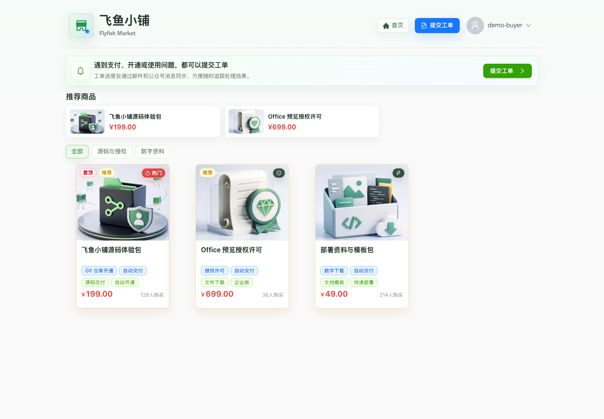
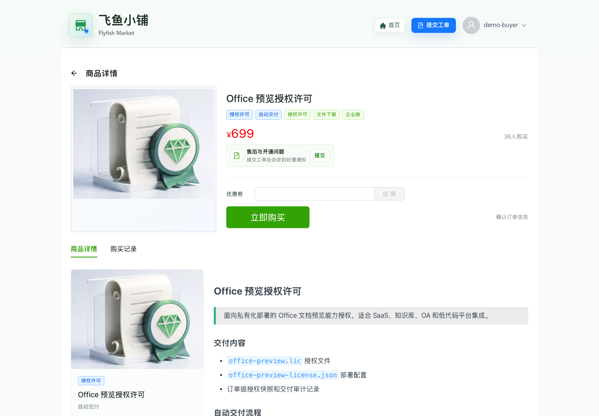
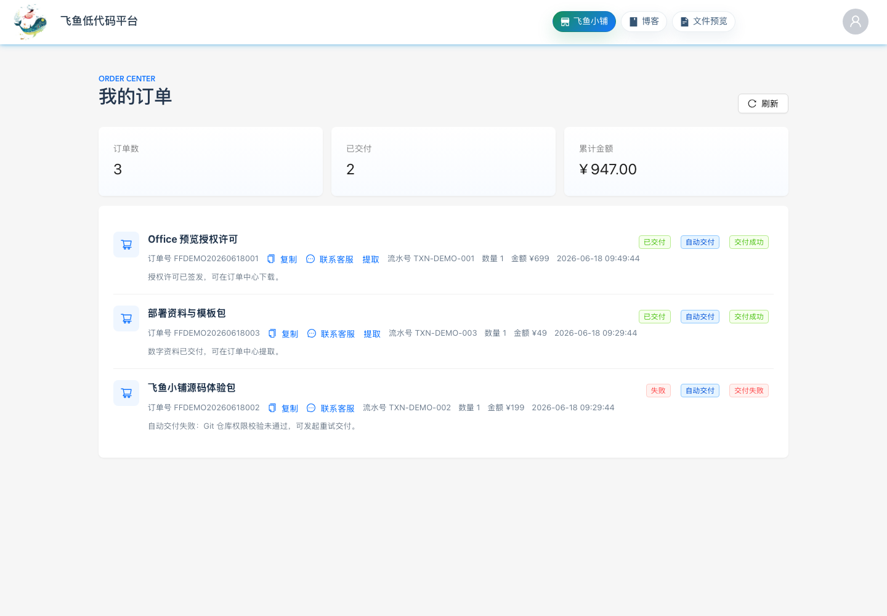
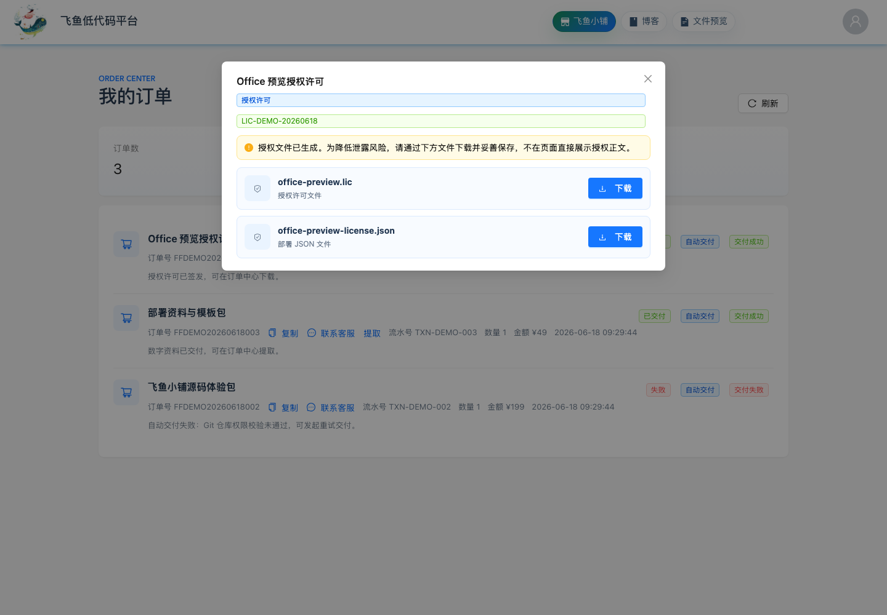
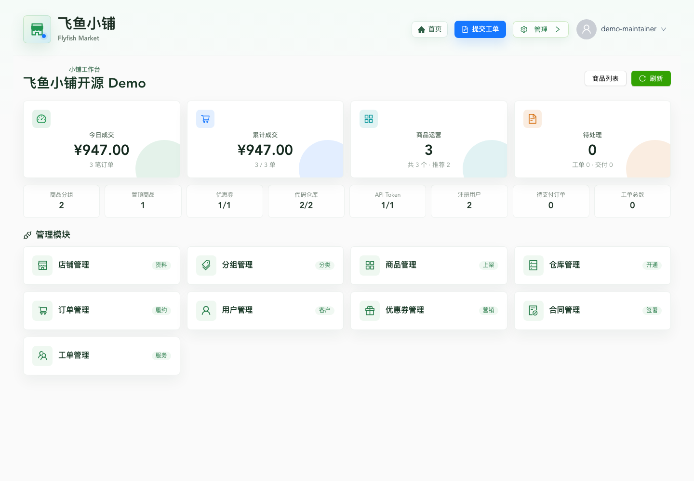
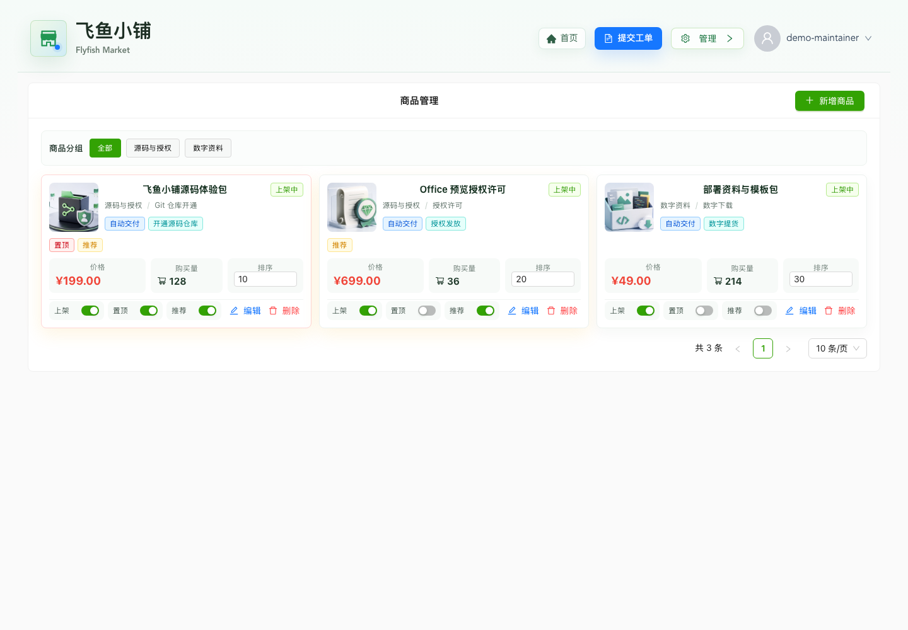
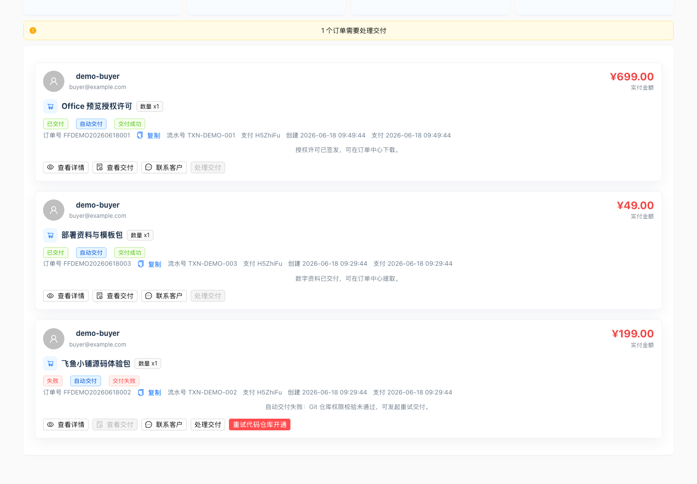
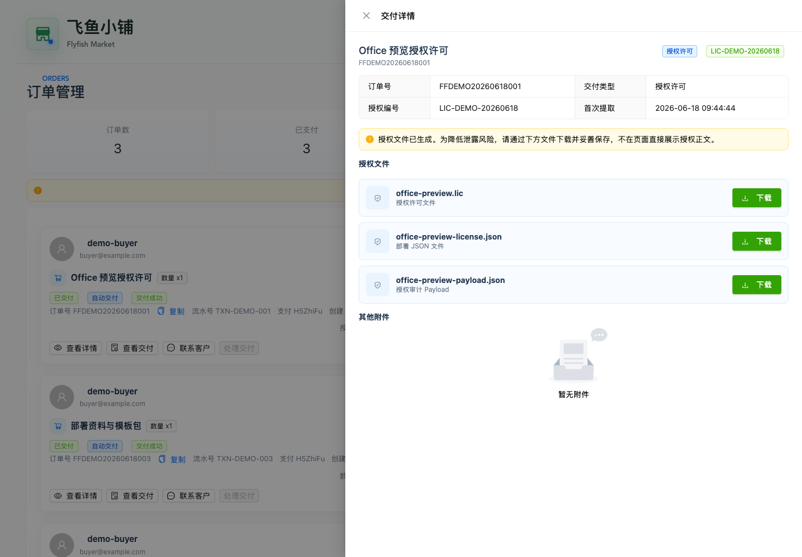
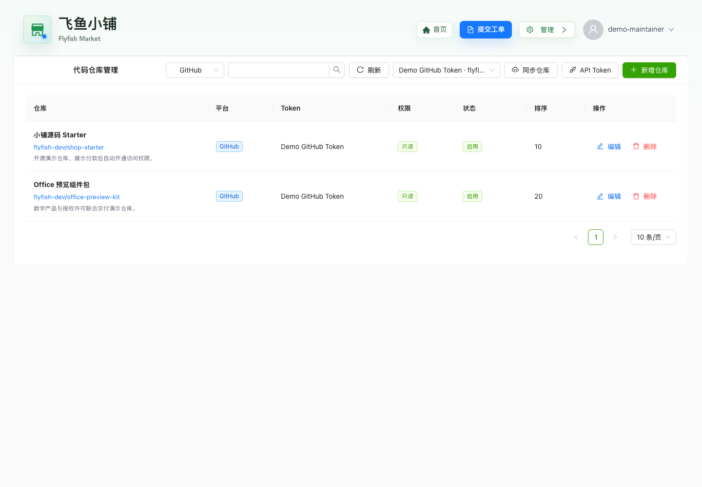

# 飞鱼小铺 / Flyfish Shop

飞鱼小铺是一套面向独立开发者、小团队和数字产品交付场景的开源小铺系统，覆盖商品展示、下单支付、订单管理、优惠券、合同确认、Git 仓库交付、源码 License 交付、客服工单、公众号快捷登录、邮箱 magic link 登录等核心流程。当前仓库同时保留飞鱼低代码平台的最小运行实例，并通过独立认证服务共享登录态，方便按需运行认证、低代码平台和小铺。

本仓库是飞鱼小铺源码交付版：已移除本地数据库、构建产物、测试截图和真实第三方密钥，提供 Docker native 一键体验、标准 Maven/Node 构建、模块化后端实例和单前端登录态。文件预览静态资源由 `web/scripts/sync-file-viewer.mjs` 在构建时从 npm 同步，生成目录不会提交到源码仓库。所有敏感配置均通过环境变量注入，请勿把 `.env`、数据库文件、证书或生产日志提交到仓库。

## 在线预览

当前生产小铺地址：

```text
https://dev.flyfish.group/shop/item-list
```

可以直接访问线上页面了解商品列表、商品详情、订单入口、客服工单和登录流程。第三方登录、支付、仓库交付等能力依赖生产环境配置，请以页面实际可用能力为准。

## 项目截图

以下截图使用本地脱敏 Demo 数据生成，订单号、邮箱、Token、仓库和授权编号均为示例值。

### 商品购买链路

| 场景 | 亮点 | 截图 |
| --- | --- | --- |
| 商品列表 | 推荐商品、分组筛选、商品标签、自动交付方式和购买量一屏呈现 |  |
| 商品详情 | 授权许可商品详情、售后入口、优惠券和购买确认链路 |  |
| 我的订单 | 用户侧订单中心展示支付状态、交付状态、提取和客服入口 |  |
| 交付提取 | Magic link 共享登录态下提取授权文件，敏感正文不直接暴露在页面 |  |

### 管理视图

| 场景 | 亮点 | 截图 |
| --- | --- | --- |
| 小铺工作台 | 成交、商品、仓库、优惠券、用户和工单指标聚合 |  |
| 商品管理 | 商品卡片化管理，支持上架、推荐、置顶、排序和交付策略配置 |  |
| 订单重试 | 按失败任务展示重试按钮，可重新发起自动交付并继续履约流程 |  |
| 交付详情 | 管理端只读核查授权快照和授权文件，便于售后审计 |  |
| 仓库管理 | 统一管理可交付仓库与 API Token，商品交付直接复用仓库配置 |  |

## 架构概览

```text
flyfish-common                         通用基础设施、异常、JSON、R2DBC、缓存控制
flyfish-auth/flyfish-auth-api          共享认证 API、用户 VO、授权工具、远程客户端接口
flyfish-auth/flyfish-auth-app          认证服务实例，JWT、OAuth、微信快捷登录、邮箱 magic link
flyfish-platform                       门户能力发现、公共工作台、上传、远程认证客户端
flyfish-git                            Git 平台集成、访问 Token 与仓库元数据
flyfish-lowcode/flyfish-lowcode-api    低代码平台对外 API 边界
flyfish-lowcode/flyfish-lowcode-app    低代码平台最小运行实例
flyfish-shop/flyfish-shop-api          小铺对外 API 边界
flyfish-shop/flyfish-shop-app          飞鱼小铺最小运行实例
web                                    Vue 3 单前端，按 capability 动态展示低代码/小铺页面
```

前端只有一套登录态，认证实现集中在 `flyfish-auth/flyfish-auth-app`。低代码平台和小铺不直接互相依赖，通过 `flyfish-auth-api` 和远程认证客户端共享用户态。

## Docker Native 一键体验

本仓库提供基于 GraalVM native image 的 Docker Compose 体验模式，会一次性启动 MySQL、native 后端和 Nginx 前端：

```bash
./scripts/docker-native-up.sh
```

首次执行会在 Docker 内构建 linux/amd64 native 镜像，耗时较长。完成后访问：

```text
http://127.0.0.1:9999
```

停止服务：

```bash
./scripts/docker-native-down.sh
```

完整说明见 [docs/docker-native-deploy.md](docs/docker-native-deploy.md)。

## 本地启动

### 环境要求

- JDK 21+
- Maven Wrapper，项目已内置 `./mvnw`
- Node.js 20+ 与 npm
- 本地开发默认使用 H2 文件库；生产推荐 MySQL 8+

### 后端

认证服务：

```bash
./mvnw -pl flyfish-auth/flyfish-auth-app -am -DskipTests package
java -jar flyfish-auth/flyfish-auth-app/target/flyfish-auth.jar --spring.profiles.active=local
```

仅小铺实例：

```bash
./mvnw -pl flyfish-shop/flyfish-shop-app -am -DskipTests package
java -jar flyfish-shop/flyfish-shop-app/target/flyfish-shop.jar --spring.profiles.active=local
```

仅低代码实例：

```bash
./mvnw -pl flyfish-lowcode/flyfish-lowcode-app -am -DskipTests package
java -jar flyfish-lowcode/flyfish-lowcode-app/target/flyfish-lowcode.jar --spring.profiles.active=local
```

### 前端

```bash
cd web
npm ci
npm run dev
```

默认前端地址为 `http://127.0.0.1:9999`。开发代理会按路径分别转发到认证 `10080`、低代码 `10081`、小铺 `10082`。

## 生产上线指引

1. 准备 MySQL 数据库，创建业务库和独立账号。
2. 复制 `.env.example` 中需要的环境变量到部署平台，填入真实值。
3. 设置强随机 `USER_JWT_SECRET`，所有实例必须一致，否则共享登录态会失效。
4. 配置 `OAUTH_CALLBACK_URL`、邮箱 magic link base URL、公众号网页入口、支付回调地址，确保域名和 HTTPS 证书已生效。
5. 构建后端 jar：

   ```bash
   ./mvnw -pl flyfish-auth/flyfish-auth-app,flyfish-lowcode/flyfish-lowcode-app,flyfish-shop/flyfish-shop-app -am -DskipTests clean package
   ```

6. 构建前端静态资源：

   ```bash
   cd web
   npm ci
   npm run build
   ```

7. 使用 Nginx、CDN 或对象存储托管 `web/dist`，并将 `/portal`、`/oauth`、`/email`、`/wx`、`/shops`、`/integrity` 等 API 路径反向代理到后端。也可以参考 [docs/docker-native-deploy.md](docs/docker-native-deploy.md) 使用 Docker Compose 运行 native 镜像。
8. 在第三方平台后台配置回调：
   - OAuth 回调：`https://你的域名/oauth/callback`
   - 邮箱 magic link：`EMAIL_MAGIC_LINK_BASE_URL=https://你的域名`
   - 微信公众号服务器地址与网页授权域名
   - 支付异步通知：`https://你的域名/shops/payments/h5zhifu/notify`
9. 上线后执行冒烟测试，确认能力发现、登录态、商品列表、订单、工单与管理端权限正常。

Native 构建与生产部署细节可参考 [docs/native-build-deploy.md](docs/native-build-deploy.md)，模块边界说明可参考 [docs/module-architecture.md](docs/module-architecture.md)。

## 上线物料清单

上线前请准备并妥善保管以下物料：

- 域名、HTTPS 证书、DNS 解析和反向代理配置
- MySQL 8+ 数据库地址、库名、账号、密码
- `USER_JWT_SECRET`，建议使用 32 字符以上随机值
- OAuth 应用：
  - Gitea client id / secret
  - Gitee client id / secret
  - GitHub client id / secret
- SMTP 邮件服务：
  - host、port、username、password、from
  - magic link 发信域名和 SPF/DKIM/DMARC 配置
- 微信公众号：
  - AppID、AppSecret
  - 消息 Token、EncodingAESKey
  - 客服二维码素材 media_id
  - 服务器地址、网页授权域名、JS 接口安全域名
- 支付渠道：
  - H5 支付 app id、通信 key
  - 支付回调公网 HTTPS 地址
  - 回调 IP 白名单或防火墙策略
- Git 交付能力：
  - Gitea/GitHub 管理 Token
  - 可交付仓库、组织、权限策略
- 运维：
  - 日志采集、监控告警、备份策略
  - 数据库备份和恢复演练
  - 前端静态资源发布路径

## 关键环境变量

完整模板见 [.env.example](.env.example)。

| 类别 | 变量 |
| --- | --- |
| Docker native | `FLYFISH_HTTP_PORT`, `FLYFISH_AUTH_PORT`, `FLYFISH_LOWCODE_PORT`, `FLYFISH_SHOP_PORT`, `FLYFISH_DOCKER_PLATFORM`, `MYSQL_PASSWORD`, `MYSQL_ROOT_PASSWORD`, `NATIVE_BUILD_XMX` |
| 数据库 | `SPRING_R2DBC_URL`, `SPRING_R2DBC_USERNAME`, `SPRING_R2DBC_PASSWORD` |
| 认证 | `USER_JWT_SECRET`, `OAUTH_CALLBACK_URL` |
| OAuth | `OAUTH_GITEA_CLIENT_ID`, `OAUTH_GITEA_CLIENT_SECRET`, `OAUTH_GITEE_CLIENT_ID`, `OAUTH_GITEE_CLIENT_SECRET`, `OAUTH_GITHUB_CLIENT_ID`, `OAUTH_GITHUB_CLIENT_SECRET` |
| 邮件登录 | `EMAIL_MAGIC_LINK_BASE_URL`, `EMAIL_MAGIC_LINK_FROM`, `SPRING_MAIL_HOST`, `SPRING_MAIL_USERNAME`, `SPRING_MAIL_PASSWORD` |
| 微信 | `WX_MP_APP_ID`, `WX_MP_SECRET`, `WX_MP_TOKEN`, `WX_MP_AES_KEY`, `WX_MP_QUICK_LOGIN_BASE_URL` |
| 支付 | `H5ZHIFU_APP_ID`, `H5ZHIFU_KEY`, `H5ZHIFU_NOTIFY_URL` |
| 通知 | `SUPPORT_NOTIFICATION_MAIL_ADMIN_RECIPIENTS`, `SUPPORT_NOTIFICATION_WECHAT_ADMIN_OPENIDS` |

## 验证命令

后端测试：

```bash
./mvnw test
```

前端构建与架构检查：

```bash
cd web
npm ci
npm run build
npm run test:architecture
npm run test:build-artifacts
npm run test:route-smoke
```

应用冒烟：

```bash
scripts/check-app-artifacts.sh
scripts/smoke-minimal-apps.sh
scripts/smoke-authenticated-apps.sh
```

UI 截图冒烟需要本机可执行 Playwright：

```bash
scripts/smoke-ui-pages.sh
scripts/smoke-ui-authenticated-pages.sh
```

## 安全注意事项

- 不要提交 `.env`、数据库文件、日志、证书、密钥或第三方平台真实凭据。
- 生产环境必须覆盖默认 `USER_JWT_SECRET`。
- 邮箱 magic link 默认只在当前服务进程内记录已使用 nonce；多实例部署建议将一次性 token 状态迁移到 Redis 或数据库。
- 管理端接口依赖共享认证和维护者授权，请上线前用普通用户与维护者用户分别验证权限。
- 支付回调必须开启 HTTPS，并校验签名。

## 开源许可

本项目采用 [GNU Affero General Public License v3.0 only](LICENSE)，SPDX 标识为 `AGPL-3.0-only`。

AGPLv3 是强 copyleft 协议：修改、分发或通过网络提供服务时，需要按协议要求向用户提供对应源码，并保留相同许可证。
