<p align="center">
  <a href="https://dev.flyfish.group/shop/item-list">
    
  </a>
</p>

<h1 align="center">飞鱼小铺 / Flyfish Shop</h1>

<p align="center">
  <strong>面向数字产品、源码仓库与开发者服务的开源交易和自动交付系统</strong>
</p>

<p align="center">
  <a href="https://github.com/flyfish-dev/shop/actions/workflows/ci.yml"></a>
  
  
  
  
  <a href="LICENSE"></a>
</p>

飞鱼小铺服务于独立开发者、小团队和数字产品交付场景，覆盖商品展示、SKU、订单、合同、优惠券、人民币与美元定价、Stripe/H5 支付、Git 仓库开通、数字文件交付、失败任务重试、客服工单和多渠道登录。仓库同时提供飞鱼低代码平台的最小运行实例，并由独立认证服务为两套业务共享登录态。

<p align="center">
  <a href="https://dev.flyfish.group/shop/item-list"><strong>在线预览</strong></a>
  ·
  <a href="#docker-native"><strong>快速体验</strong></a>
  ·
  <a href="#screenshots"><strong>项目截图</strong></a>
  ·
  <a href="#production"><strong>上线指引</strong></a>
</p>

<p align="center">
  <a href="https://dev.flyfish.group/shop/item-list">
    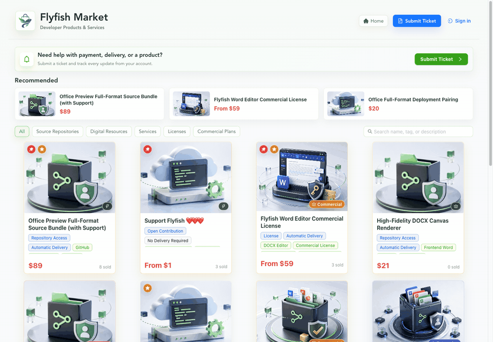
  </a>
</p>

## 在线预览

生产小铺：**[https://dev.flyfish.group/shop/item-list](https://dev.flyfish.group/shop/item-list)**

无需登录即可浏览商品列表、商品详情、搜索筛选、国际化界面和赞助页。登录、支付、仓库交付等能力依赖线上渠道配置，请勿在预览环境提交测试订单。

## 核心能力

| 领域 | 已提供能力 |
| --- | --- |
| 商品与定价 | 商品分组、搜索、推荐、置顶、排序、SKU、多语言内容、人民币/美元展示、打赏商品 |
| 订单与支付 | 下单、试算、优惠券、合同确认、Stripe Checkout、H5 支付、回调验签与幂等处理 |
| 自动交付 | GitHub/Gitea/Gitee 仓库开通、数字文件、通用授权扩展、任务级失败原因与重试续跑 |
| 共享认证 | 独立 Auth 服务、JWT 共享登录态、邮箱 Magic Link、GitHub/Gitee/Gitea、Google、Microsoft、微信公众号 |
| 运营与服务 | 管理工作台、商品和订单管理、合同、仓库、工单、WebSocket 客服、通知和公众号动态 |
| 工程交付 | Spring Boot 多模块、Vue 3 单前端、MySQL/H2、GraalVM Native、Docker Compose、Nginx 示例 |

## 开源边界

本仓库是经过边界审计的源码交付版，公开的是可独立运行的小铺、认证、低代码最小实例及通用交付编排：

- 包含商品、订单、支付接入、合同、客服、仓库交付和任务重试等完整业务代码。
- 商业授权交付仅保留 [`ExternalLicenseIssuer`](flyfish-shop/flyfish-shop-app/src/main/java/group/flyfish/dev/shop/license/ExternalLicenseIssuer.java) 扩展契约和通用流程。
- 不包含任何商业授权签发算法、根密钥材料、专有签发协议、生产配置、生产数据或内部运维客户端。
- 外部登录、邮件、公众号、支付和 Git 平台默认关闭或保持未配置状态，必须通过环境变量显式启用。
- `.env`、数据库、日志、证书、构建产物和本地运行目录均不属于源码交付范围。

如果需要接入自有授权系统，请在私有模块中实现 `ExternalLicenseIssuer`，通过 Spring Bean 注入，不要把签发密钥或专有实现提交到业务仓库。

<a id="screenshots"></a>

## 项目截图

全部截图与演示 GIF 均采用中文界面。公开页面截图来自未登录的生产访客会话；订单与管理视图使用本地脱敏 Demo 数据。截图中不存在真实用户、邮箱、Token、仓库凭据、订单号或授权材料。

### 商品购买链路

| 场景 | 亮点 | 截图 |
| --- | --- | --- |
| 商品列表 | 推荐商品、分组筛选、搜索、多语言内容、价格和交付标签一屏呈现 | 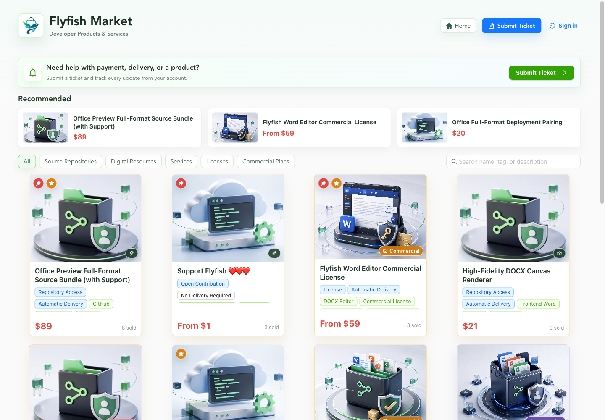 |
| 商品详情 | 仓库绑定、订单表单、售后入口、支付方式和购买状态在同一流程完成 | 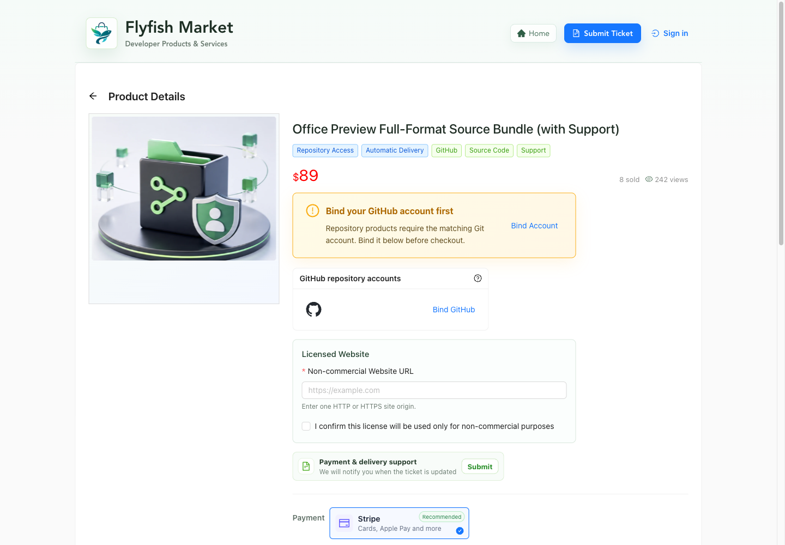 |
| 赞助页面 | 美元金额阶梯、Stripe 支付和开源项目说明形成独立赞助链路 | 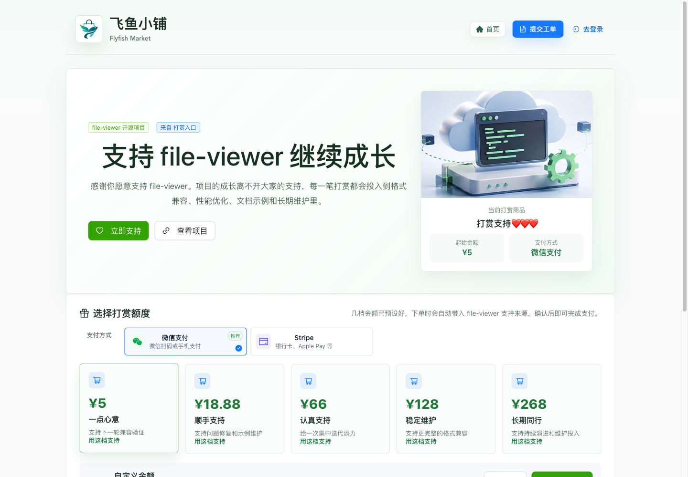 |
| 移动端列表 | 推荐、筛选、搜索与商品卡片针对手机视口自然重排 | 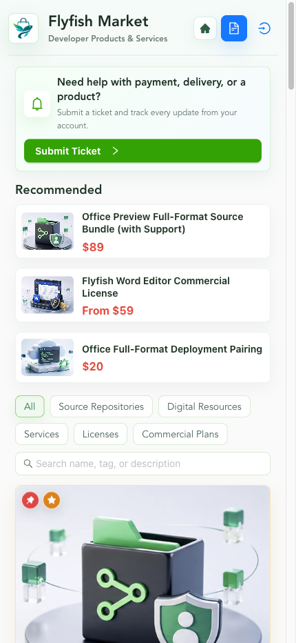 |
| 我的订单 | 用户侧订单中心展示支付状态、交付状态、提取和客服入口 | 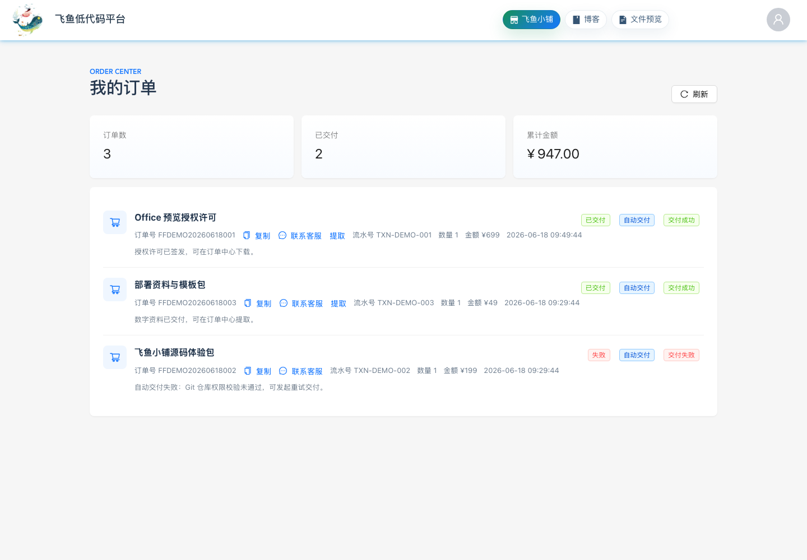 |
| 交付提取 | 共享登录态下提取交付文件，敏感正文不在页面直接暴露 | 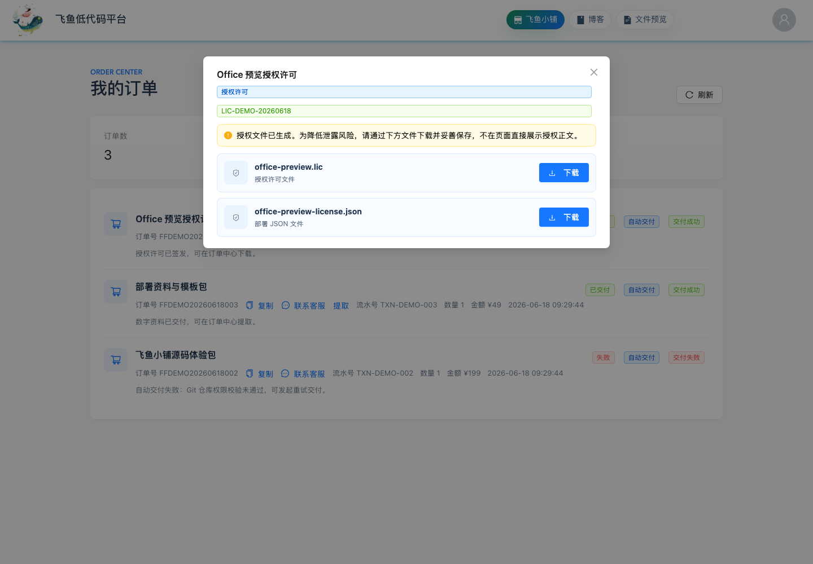 |

### 管理视图

| 场景 | 亮点 | 截图 |
| --- | --- | --- |
| 小铺工作台 | 成交、商品、仓库、优惠券、用户和工单指标聚合 | 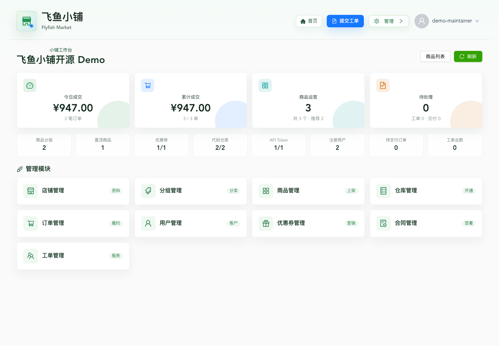 |
| 商品管理 | 卡片化管理商品，支持上架、推荐、置顶、排序、SKU 和交付策略 | 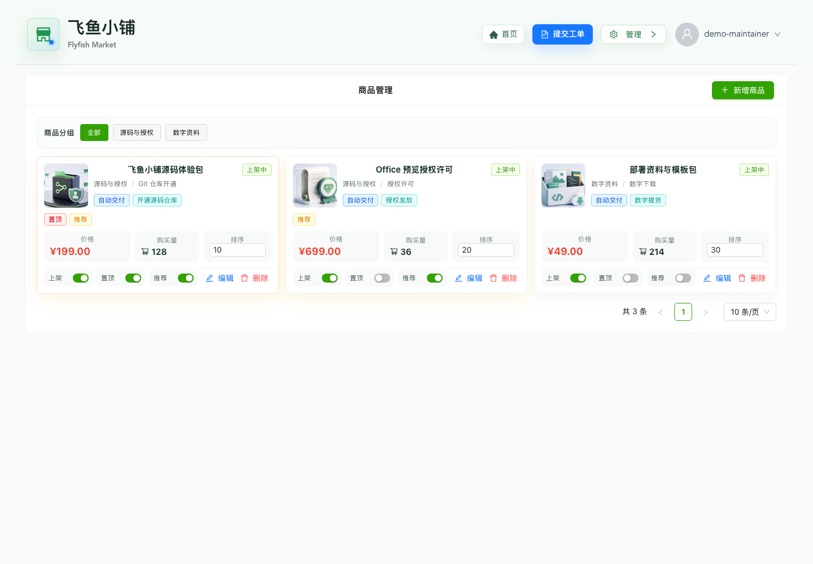 |
| 订单重试 | 按失败任务提供重试入口，成功后继续后续任务并完成履约 | 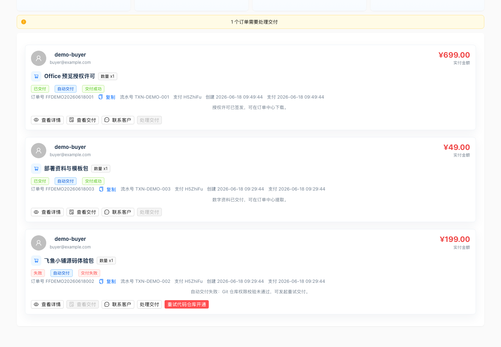 |
| 交付详情 | 管理端核查交付快照、执行记录和可下载产物，便于售后审计 | 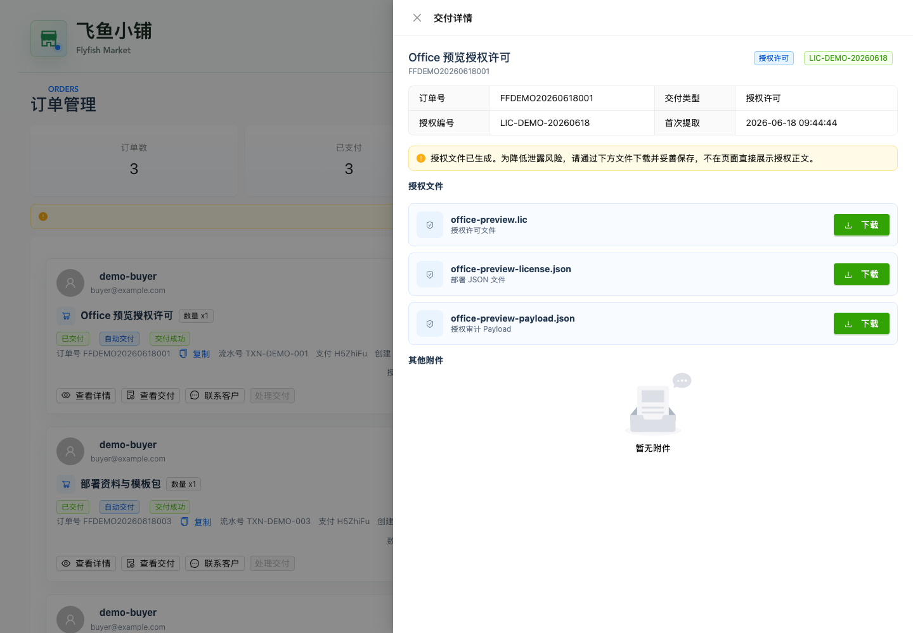 |
| 仓库管理 | 统一管理可交付仓库和 API Token，商品直接复用仓库配置 | 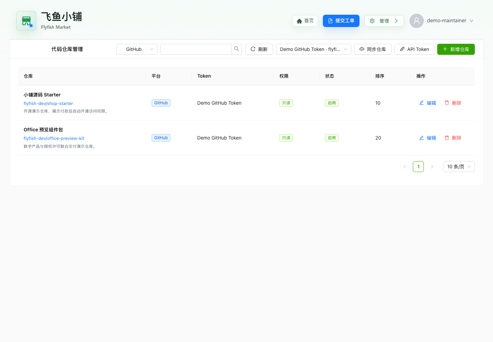 |

## 架构概览

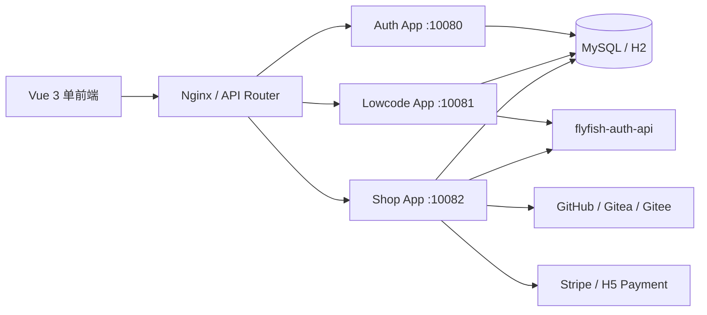
```mermaid
flowchart LR
    Web["Vue 3 单前端"] --> Nginx["Nginx / API Router"]
    Nginx --> Auth["Auth App :10080"]
    Nginx --> Lowcode["Lowcode App :10081"]
    Nginx --> Shop["Shop App :10082"]
    Lowcode --> AuthApi["flyfish-auth-api"]
    Shop --> AuthApi
    Auth --> DB[("MySQL / H2")]
    Lowcode --> DB
    Shop --> DB
    Shop --> Git["GitHub / Gitea / Gitee"]
    Shop --> Pay["Stripe / H5 Payment"]
```

```text
flyfish-common                         通用响应、异常、JSON、R2DBC 与基础设施
flyfish-auth/flyfish-auth-api          共享认证契约、用户 VO 与远程客户端接口
flyfish-auth/flyfish-auth-app          JWT、OAuth、微信快捷登录、邮箱 Magic Link
flyfish-platform                       能力发现、公共工作台、上传与远程认证客户端
flyfish-git                            Git 平台、访问 Token、仓库元数据与开通能力
flyfish-lowcode/flyfish-lowcode-api    低代码平台对外 API 边界
flyfish-lowcode/flyfish-lowcode-app    低代码平台最小运行实例
flyfish-shop/flyfish-shop-api          小铺对外 API 边界
flyfish-shop/flyfish-shop-app          小铺最小运行实例与业务实现
web                                    Vue 3 单前端，按 capability 装载业务入口
```

认证实现集中在 `flyfish-auth-app`。低代码平台与小铺不直接依赖彼此，仅通过共享 API 契约和认证客户端获取用户态，前端也只维护一份登录状态。

## Docker Native

需要 Docker Engine 或 Docker Desktop，并建议为首次 native 构建预留至少 8 GB 内存：

```bash
./scripts/docker-native-up.sh
```

脚本会构建 linux/amd64 GraalVM native 镜像，并启动 MySQL、三个 native 后端实例和 Nginx 前端。首次构建耗时较长，完成后访问：

```text
http://127.0.0.1:9999
```

查看状态和停止服务：

```bash
docker compose -f deploy/docker/docker-compose.native.yml ps
./scripts/docker-native-down.sh
```

默认配置只适合本机体验。公开部署前必须复制 `.env.example` 为 `.env`，更换数据库密码和 `USER_JWT_SECRET`，并按需启用外部渠道。完整说明见 [Docker Native 部署指南](docs/docker-native-deploy.md)。

## 本地开发

环境要求：JDK 21+、Node.js 24+、npm，以及项目自带的 Maven Wrapper。local profile 默认使用 H2 文件库。

分别启动三个后端实例：

```bash
./mvnw -pl flyfish-auth/flyfish-auth-app -am -DskipTests package
java -jar flyfish-auth/flyfish-auth-app/target/flyfish-auth.jar --spring.profiles.active=local

./mvnw -pl flyfish-lowcode/flyfish-lowcode-app -am -DskipTests package
java -jar flyfish-lowcode/flyfish-lowcode-app/target/flyfish-lowcode.jar --spring.profiles.active=local

./mvnw -pl flyfish-shop/flyfish-shop-app -am -DskipTests package
java -jar flyfish-shop/flyfish-shop-app/target/flyfish-shop.jar --spring.profiles.active=local
```

启动前端：

```bash
cd web
npm ci
npm run dev
```

默认前端地址是 `http://127.0.0.1:9999`，Vite 会将认证、低代码和小铺路径分别代理到 `10080`、`10081`、`10082`。

## Production

1. 准备 MySQL 8+、独立业务账号、域名、DNS 和 HTTPS 证书。
2. 从 [.env.example](.env.example) 创建生产环境配置，在部署平台或密钥管理服务中填写真实值。
3. 使用至少 32 字节随机值设置 `USER_JWT_SECRET`，并确保三个后端实例完全一致。
4. 配置 `OAUTH_CALLBACK_URL`、Magic Link 域名、公众号入口和支付回调，确认公网 HTTPS 已生效。
5. 选择 Docker Native 部署，或分别构建三个后端与前端静态资源。
6. 使用 Nginx 将 `/portal`、`/oauth`、`/email`、`/wx`、`/shops`、`/integrity` 等路径代理到对应实例。
7. 按实际品牌修改 `web/src/pages/Legal/` 中的隐私政策、服务条款、主体信息和备案信息。
8. 上线后验证能力发现、共享登录态、商品列表、订单、支付回调、交付、工单和管理权限。

Jar 与前端构建：

```bash
./mvnw -pl flyfish-auth/flyfish-auth-app,flyfish-lowcode/flyfish-lowcode-app,flyfish-shop/flyfish-shop-app -am -DskipTests clean package
cd web
npm ci
npm run build
```

第三方回调示例：

```text
OAuth:          https://shop.example.com/oauth/callback
Magic Link:     EMAIL_MAGIC_LINK_BASE_URL=https://shop.example.com
H5 payment:     https://shop.example.com/shops/payments/h5zhifu/notify
Stripe webhook: https://shop.example.com/shops/payments/stripe/webhook
```

更多细节见 [Native 构建与部署](docs/native-build-deploy.md) 和 [模块架构说明](docs/module-architecture.md)。

## 上线物料

| 类别 | 必备物料 |
| --- | --- |
| 基础设施 | 域名、DNS、HTTPS 证书、Nginx/CDN、MySQL 8+、数据库备份与恢复方案 |
| 共享认证 | 强随机 `USER_JWT_SECRET`、OAuth 回调域名、管理员账号归属策略 |
| OAuth | 按需准备 Gitea、Gitee、GitHub、Google、Microsoft 的 client id / secret |
| 邮件 | SMTP host、port、username、password、from，以及 SPF/DKIM/DMARC |
| 微信公众号 | AppID、AppSecret、消息 Token、EncodingAESKey、素材 media_id、网页授权域名 |
| 支付 | Stripe secret key / webhook secret，或 H5 支付 app id / key / 回调白名单 |
| Git 交付 | Git 平台管理 Token、可交付仓库、组织和最小权限策略 |
| 运维 | 日志、监控、告警、数据库备份、发布回滚和密钥轮换流程 |

## 关键配置

完整模板见 [.env.example](.env.example)。所有外部渠道均应按需启用，未配置密钥时不要打开对应 `*_ENABLED` 开关。

| 类别 | 变量 |
| --- | --- |
| Docker | `FLYFISH_HTTP_PORT`, `FLYFISH_DOCKER_PLATFORM`, `MYSQL_PASSWORD`, `MYSQL_ROOT_PASSWORD`, `NATIVE_BUILD_XMX` |
| 数据库 | `SPRING_R2DBC_URL`, `SPRING_R2DBC_USERNAME`, `SPRING_R2DBC_PASSWORD` |
| 认证 | `USER_JWT_SECRET`, `OAUTH_CALLBACK_URL`, `FLYFISH_AUTH_BASE_URL` |
| OAuth | `OAUTH_GITEA_*`, `OAUTH_GITEE_*`, `OAUTH_GITHUB_*`, `OAUTH_GOOGLE_*`, `OAUTH_MICROSOFT_*` |
| 邮件登录 | `EMAIL_MAGIC_LINK_ENABLED`, `EMAIL_MAGIC_LINK_BASE_URL`, `SPRING_MAIL_*` |
| 微信 | `WX_MP_APP_ID`, `WX_MP_SECRET`, `WX_MP_TOKEN`, `WX_MP_AES_KEY`, `WX_MP_QUICK_LOGIN_BASE_URL` |
| 支付与定价 | `H5ZHIFU_*`, `STRIPE_*`, `SHOP_PRICING_CNY_PER_USD` |
| 通知 | `SUPPORT_NOTIFICATION_*` |
| 低代码 | `LOWCODE_CACHE_PATH`, `LOWCODE_GENERATOR_R2DBC_*`, `LOWCODE_GENERATOR_PACKAGE_PARENT` |

## 质量验证

```bash
./mvnw test

cd web
npm ci
npm run build
npm run test:architecture
npm run test:build-artifacts
npm run test:route-smoke
```

最小应用和认证冒烟：

```bash
scripts/check-app-artifacts.sh
scripts/smoke-minimal-apps.sh
scripts/smoke-authenticated-apps.sh
```

## 安全

- 禁止提交 `.env`、数据库、日志、证书、密钥、第三方真实凭据或生产导出数据。
- 生产环境必须覆盖默认数据库密码和 `USER_JWT_SECRET`，并使用密钥管理服务注入。
- 邮箱 Magic Link 的一次性状态在多实例环境中应迁移到 Redis 或数据库。
- 管理接口依赖共享认证和维护者权限，上线前必须分别使用匿名、普通用户和管理员验证。
- 支付回调必须使用 HTTPS、原始请求体验签、幂等处理和最小化日志。
- 安全问题请遵循 [SECURITY.md](SECURITY.md) 中的私下报告流程，不要公开披露可利用细节。

## 参与贡献

提交问题或代码前请阅读 [CONTRIBUTING.md](CONTRIBUTING.md)。改动应保持模块边界，补充与风险相匹配的测试，并确保不包含任何本地或生产数据。

## 开源许可

本项目采用 [GNU Affero General Public License v3.0 only](LICENSE)，SPDX 标识为 `AGPL-3.0-only`。

AGPLv3 是强 copyleft 协议。修改、分发或通过网络向用户提供本项目服务时，需要按许可证要求向对应用户提供完整源代码，并继续使用兼容的开源许可。
